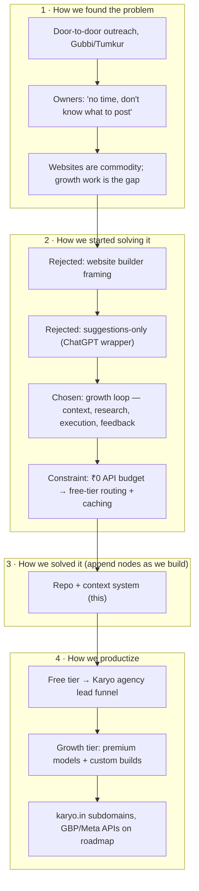

# Journey — living graph

Rules: every major decision or milestone gets a node. Keep node text ≤ 12 words. This graph IS the pitch backbone; if it's not here, it didn't happen. GitHub renders Mermaid natively — no build step, no tooling, nothing to break.

## Node log (append-only)

| Date | Node | Note |
|---|---|---|
| DAY0 | B1 | Repo scaffold, CLAUDE.md context system, team protocol |
