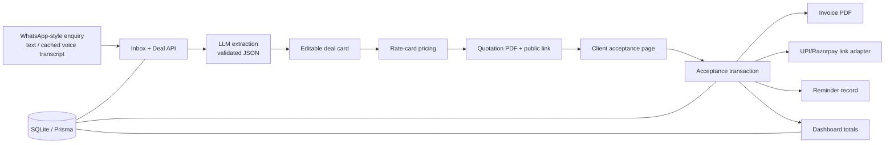

# System Architecture — Kagaz

## Boundaries

The app owns extraction, review, pricing, PDF creation, document states, and dashboard calculations. A payment provider only receives an amount/reference after client acceptance. WhatsApp, transcription, payment creation, and reminders have adapters so each can be simulated without breaking the core demonstration.

## State transitions

`new → extracted → draft → quoted → accepted → invoiced → payment_pending → paid`

`quoted → expired` is valid after expiry. `accepted` is terminal for the quote and cannot be revoked in MVP; create a new quote instead.

## Public link security

Generate a cryptographically random token per quote, store only a hash if time permits, and resolve `/q/{token}` server-side. The page can read only that quote’s client-facing fields. Acceptance is a POST protected by same-site origin checks and an idempotency key.
